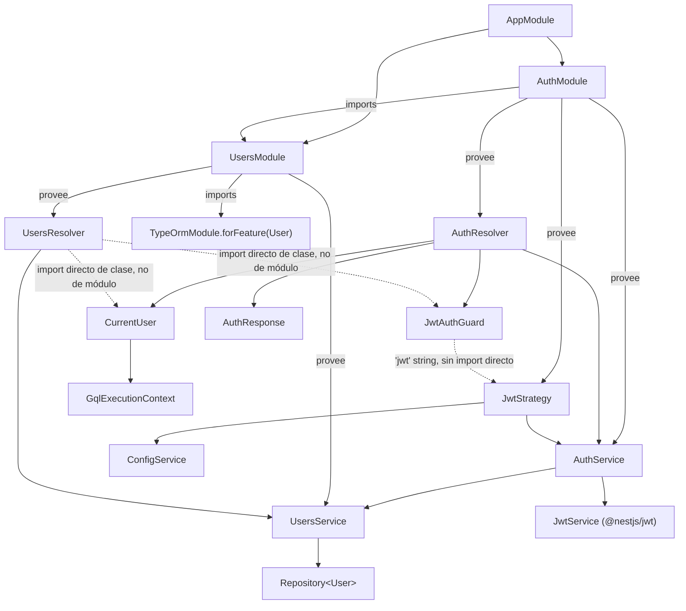

# Análisis de referencia: módulos `auth` y `users` de `nest-anylist`

> Análisis de `C:\projects\nest\nest-anylist\src\{auth,users}` (NestJS + TypeORM + GraphQL + Passport/JWT), hecho para servir de base al construir los módulos equivalentes en `exp-shop` (NestJS + Prisma + GraphQL). No se modificó nada del proyecto analizado.

---

## 1. Mapa de archivos: qué hace cada uno

### `auth/`

| Archivo | Rol |
|---|---|
| `auth.module.ts` | Ensambla el módulo: registra Passport, JWT y expone `AuthService`/`JwtStrategy` |
| `auth.resolver.ts` | Puerta de entrada GraphQL: `signup`, `login`, `revalidate` |
| `auth.service.ts` | Lógica de negocio: crear token, verificar password, validar usuario |
| `decorators/curren-user.decorator.ts` | Decorador custom `@CurrentUser()` — saca el usuario autenticado del request |
| `dto/inputs/login.input.ts` | `InputType` GraphQL para el mutation `login` |
| `dto/inputs/signup.input.ts` | `InputType` GraphQL para el mutation `signup` |
| `enums/valid-roles.enums.ts` | Enum de roles (`admin`, `user`, `superUser`), registrado como enum de GraphQL |
| `guards/jwt-auth.guard.ts` | Guard que activa la estrategia `'jwt'` de Passport, adaptado a GraphQL |
| `interfaces/jwt-payload.interface.ts` | Forma del payload que va **dentro** del JWT |
| `strategies/jwt.strategy.ts` | Define cómo se valida un JWT entrante (Passport) |
| `types/auth-response.type.ts` | `ObjectType` GraphQL que devuelven `signup`/`login`/`revalidate`: `{ token, user }` |

### `users/`

| Archivo | Rol |
|---|---|
| `entities/user.entity.ts` | Entidad TypeORM **y** `ObjectType` GraphQL a la vez (doble decorado) |
| `users.module.ts` | Registra el repositorio TypeORM de `User` y expone `UsersService` |
| `users.resolver.ts` | Queries/mutations GraphQL de usuarios, protegidas por `JwtAuthGuard` |
| `users.service.ts` | Acceso a datos vía `Repository<User>` de TypeORM |
| `dto/create-user.input.ts` | `InputType` (placeholder, no terminado en este proyecto) |
| `dto/update-user.input.ts` | `InputType` que extiende el anterior con `PartialType` |
| `dto/args/roles.arg.ts` | `ArgsType` — filtro opcional de roles para la query `users` |

---

## 2. Grafo de dependencias



**Lectura en palabras** (quién *necesita* a quién para compilar/arrancar):

- `AuthModule` **importa** `UsersModule` de forma explícita — porque `AuthService` inyecta `UsersService` en su constructor. Esto es una dependencia de módulo real y directa.
- `UsersModule` **no** importa `AuthModule** en ningún momento. Sin embargo, `UsersResolver` sí usa `JwtAuthGuard` y `@CurrentUser()`, que viven físicamente dentro de la carpeta `auth/`. Esto funciona porque son **imports directos de archivo/clase de TypeScript**, no imports de módulo de Nest — `JwtAuthGuard` no tiene ninguna dependencia inyectada por Nest (solo extiende `AuthGuard('jwt')`), así que Nest no necesita que `AuthModule` esté "importado" por `UsersModule` para poder instanciarlo.
- Lo que sí es **obligatorio** para que `JwtAuthGuard` funcione en tiempo de ejecución es que la estrategia `'jwt'` de Passport haya sido **registrada** — y eso ocurre como efecto colateral de que Nest construya `JwtStrategy` al menos una vez (Passport mantiene su propio registro global de estrategias, independiente del árbol de módulos de Nest). Como `AppModule` importa tanto `AuthModule` como `UsersModule`, `JwtStrategy` se construye igual, y todo funciona — pero es una dependencia **implícita y frágil**: si algún día `AuthModule` dejara de cargarse en el árbol de la app, `UsersResolver` compilaría perfecto pero fallaría en tiempo de ejecución con un error de estrategia `'jwt'` no encontrada.
- `JwtStrategy` depende de `AuthService` (para el método `validateUser`) — ambos viven en `AuthModule`, sin fricción.
- `CurrentUser` (el decorador) depende únicamente de `GqlExecutionContext` y de la forma de `User` — no depende de ningún servicio, es una función pura sobre el `ExecutionContext`.

---

## 3. Flujo de información

### 3.1 Registro (`signup`)

```
Cliente GraphQL
  → AuthResolver.signup(signupInput)
    → AuthService.signup(signupInput)
      → UsersService.create(signupInput)
        → bcrypt.hash(password)
        → usersRepository.save(...)          [INSERT en Postgres vía TypeORM]
      → AuthService.getJwtToken(user.id)
        → jwtService.sign({ id: userId })    [firma el JWT con JWT_SECRET]
  ← { token, user }  (tipo AuthResponse)
```

### 3.2 Login

```
Cliente GraphQL
  → AuthResolver.login(loginInput)
    → AuthService.login(loginInput)
      → UsersService.findOneByEmail(email)   [SELECT por email]
      → bcrypt.compareSync(password, user.password)
      → AuthService.getJwtToken(user.id)
  ← { token, user }
```

### 3.3 Petición autenticada (ejemplo: query `users`)

Este es el flujo más importante de entender, porque combina Passport + Guards + GraphQL:

```
Cliente envía:  Authorization: Bearer <token>  +  query { users { ... } }

1. Nest recibe la petición HTTP (POST /graphql) y arma el ExecutionContext.
2. @UseGuards(JwtAuthGuard) en UsersResolver intercepta ANTES de ejecutar el resolver.
3. JwtAuthGuard.getRequest(context):
     - convierte el ExecutionContext genérico en GqlExecutionContext
     - extrae ctx.getContext().req   (el request HTTP real, expuesto por defecto
       por @nestjs/apollo dentro del contexto de GraphQL)
4. AuthGuard('jwt') (heredado) usa esa request para:
     - extraer el header Authorization (ExtractJwt.fromAuthHeaderAsBearerToken())
     - verificar la firma del JWT contra JWT_SECRET
     - si es válido, decodificar el payload → { id, iat, exp }
     - invocar JwtStrategy.validate(payload)
5. JwtStrategy.validate(payload):
     → AuthService.validateUser(payload.id)
       → UsersService.findOneById(id)          [SELECT por id]
       → si !user.isActive → throw UnauthorizedException
     ← devuelve el User completo
6. Passport toma ese User devuelto y lo asigna a  request.user  automáticamente
   (comportamiento estándar de Passport, no algo que el código escriba a mano).
7. Recién ahí Nest ejecuta el resolver real: UsersResolver.findAll(...)
8. Dentro del resolver, @CurrentUser([ValidRoles.admin]) currentUser:
     - vuelve a construir un GqlExecutionContext
     - lee ctx.getContext().req.user   (el mismo user que Passport dejó en el paso 6)
     - si se pasaron roles como argumento, valida que currentUser.roles los incluya
     - si no, lanza ForbiddenException
9. UsersResolver.findAll ya tiene un currentUser validado y llama a
   UsersService.findAll(roles) → Repository<User>.find()/createQueryBuilder()
```

**Punto clave:** el guard (paso 2-6) y el decorador `@CurrentUser()` (paso 8) hacen el **mismo** truco de conversión (`GqlExecutionContext.create(context)`) mostrando el objeto `req` **de forma independiente uno del otro** — no se pasan datos entre sí directamente, se comunican a través de `request.user`, que Passport rellena entre ambos pasos. Este es el motivo por el que `@CurrentUser()` explota con `InternalServerErrorException('No user inside the request')` si te olvidas de poner `@UseGuards(JwtAuthGuard)` antes: sin el guard, nadie llenó `request.user`.

---

## 4. Conceptos puntuales

### `GqlExecutionContext`

Nest tiene un concepto genérico llamado `ExecutionContext` que abstrae "en qué tipo de handler estoy" (HTTP REST, GraphQL, WebSocket, RPC...) para que guards/interceptors/decoradores puedan ser reutilizados entre esos mundos. El problema: en HTTP REST, `context.switchToHttp().getRequest()` te da el `req`/`res` de Express directamente. En GraphQL **no** — el `ExecutionContext` que le llega a un guard en un resolver no tiene esa forma, porque GraphQL tiene su propio concepto de "contexto" (ver más abajo).

`GqlExecutionContext.create(context)` es un adaptador: toma el `ExecutionContext` genérico y lo "reinterpreta" como un contexto de GraphQL, exponiendo `.getContext()`, `.getArgs()`, `.getRoot()`, `.getInfo()` — es decir, los mismos cuatro parámetros que recibe cualquier resolver de GraphQL (`(parent, args, context, info)`), pero accesibles desde un guard o un decorador que en principio no sabe si está en HTTP o GraphQL.

### `context` (el contexto de GraphQL)

En GraphQL (no en Nest específicamente), cada resolver recibe cuatro argumentos: `parent`, `args`, `context`, `info`. El `context` es un objeto **compartido entre todos los resolvers de una misma petición** — se construye una vez por request y se le puede meter lo que se necesite (usuario autenticado, dataloaders, conexión a base de datos, etc.).

En este proyecto, `GraphQLModule.forRoot()` (en `app.module.ts`) **no define una función `context` custom** — y aun así `ctx.getContext().req` funciona, porque `@nestjs/apollo` ya incluye `{ req, res }` en el contexto **por defecto** cuando corre sobre Express. Es decir: el `req` de Express (con headers, etc.) viaja "escondido" dentro del `context` de GraphQL en cada petición, y eso es lo que tanto el guard como `@CurrentUser()` van a leer.

### `PassportStrategy`

Passport.js es una librería de autenticación de Node, agnóstica de framework, basada en el concepto de "estrategias" (una por mecanismo: JWT, local/usuario-password, Google OAuth, etc.). `PassportStrategy` es una función *mixin* que provee `@nestjs/passport` para envolver una estrategia nativa de Passport (en este caso `Strategy` de `passport-jwt`) en una clase inyectable de Nest.

```ts
export class JwtStrategy extends PassportStrategy(Strategy) { ... }
```

Esto hace dos cosas: (1) registra la estrategia con el nombre por defecto que le corresponda (`'jwt'` en este caso, porque viene de `passport-jwt`) en el registro global de Passport, apenas Nest construye la clase; y (2) exige que la subclase implemente un método `validate(...)`, que Passport invoca automáticamente **después** de verificar criptográficamente el token, pasándole el payload ya decodificado.

### `JwtStrategy`

Es la implementación concreta de `PassportStrategy(Strategy)` para JWT. En el `constructor`, vía `super({...})`, le dice a `passport-jwt` **de dónde sacar el token** (`ExtractJwt.fromAuthHeaderAsBearerToken()` — el header `Authorization: Bearer <token>`) y **con qué secreto verificarlo** (`configService.get('JWT_SECRET')`). El método `validate(payload)` es el que decide qué pasa una vez el token es válido: acá, busca el usuario real en base de datos (`AuthService.validateUser`) y lo devuelve — ese valor de retorno es justamente lo que Passport termina poniendo en `request.user`.

### `import { Repository } from 'typeorm'`

`Repository<T>` es la clase de TypeORM que da acceso a las operaciones CRUD de una entidad (`find`, `findOneBy`, `save`, `create`, `createQueryBuilder`, etc.), ya *tipada* contra esa entidad. No se instancia a mano — se obtiene por inyección de dependencias:

```ts
constructor(
  @InjectRepository(User)
  private readonly usersRepository: Repository<User>
) {}
```

`@InjectRepository(User)` le dice a Nest "dame el repositorio que `TypeOrmModule.forFeature([User])` registró para la entidad `User`" (eso se declaró en `UsersModule`). Es el equivalente funcional, en el mundo TypeORM, de lo que en `exp-shop` hace `PrismaService` — la diferencia es que TypeORM te da **un repositorio por entidad**, mientras que Prisma te da **un único cliente** con una propiedad por modelo (`prisma.user.findMany()` en vez de `usersRepository.find()`).

---

## 5. Guía paso a paso — cómo se construye esto sin asistencia de IA

Orden pensado por dependencias reales (cada paso solo necesita lo que ya existe de los pasos anteriores):

1. **Entidad `User`** (`users/entities/user.entity.ts`) — es la base de todo, no depende de nada del propio dominio. Decorada dos veces: `@Entity()` (TypeORM, persistencia) + `@ObjectType()` (GraphQL, lo que se expone por la API). Cada campo lleva `@Column()` **y** `@Field()` por separado — son dos sistemas de metadatos distintos conviviendo en la misma clase.
2. **DTOs de entrada básicos** (`signup.input.ts`, `login.input.ts`) — `@InputType()` + `@Field()` + decoradores de `class-validator`. No dependen de la entidad todavía.
3. **`UsersService`** — implementa CRUD contra `Repository<User>`. Necesita que la entidad ya exista (paso 1) para tipar el repositorio.
4. **`UsersModule`** — registra `TypeOrmModule.forFeature([User])`, declara `UsersService`/`UsersResolver` como providers, y **exporta `UsersService`** (esto es imprescindible: sin exportarlo, ningún otro módulo puede inyectarlo).
5. **`ValidRoles` (enum) + `JwtPayload` (interface)** — piezas pequeñas e independientes, sin dependencias del dominio. Se necesitan antes del siguiente paso.
6. **`AuthService`** — inyecta `UsersService` (por eso `AuthModule` va a necesitar importar `UsersModule`) y `JwtService` (de `@nestjs/jwt`, todavía no configurado en este punto). Implementa `signup`, `login`, `validateUser`, `getJwtToken`.
7. **`JwtStrategy`** — inyecta `AuthService` (paso 6) y `ConfigService`. No puede escribirse antes de que `AuthService.validateUser` exista.
8. **`JwtAuthGuard`** — extiende `AuthGuard('jwt')`; el string `'jwt'` solo va a "encontrar algo" en tiempo de ejecución si `JwtStrategy` (paso 7) ya fue registrado por Nest en algún módulo cargado.
9. **`CurrentUser` (decorador)** — depende de `GqlExecutionContext` y de la forma de `User`; no depende de ningún service, así que puede escribirse en paralelo a los pasos 6-8.
10. **`AuthResponse` (type) + `AuthResolver`** — el resolver ata todo: usa `AuthService` (6), `JwtAuthGuard` (8) y `CurrentUser` (9).
11. **`AuthModule`** — el último en armarse: importa `ConfigModule`, `PassportModule.register({ defaultStrategy: 'jwt' })`, `JwtModule.registerAsync(...)` (acá es donde realmente se configura el `JwtService` que `AuthService` venía esperando desde el paso 6), y `UsersModule`. Declara `AuthResolver`, `AuthService`, `JwtStrategy` como providers.
12. **Volver a `UsersResolver`** y agregar `@UseGuards(JwtAuthGuard)` + `@CurrentUser()` en las queries que lo necesiten — recién acá tiene sentido, porque antes esas dos piezas no existían.
13. **`AppModule`** — importar `AuthModule` y `UsersModule` a nivel raíz. Este paso es el que efectivamente "activa" la estrategia `'jwt'` en toda la app (ver la nota de dependencia implícita en la sección 2).

Si alguien siguiera este orden sin ayuda de IA, en cualquier paso donde el compilador se queje de un import que no existe, es señal de que ese paso depende de algo de un paso posterior en esta lista — normalmente indica que conviene adelantar ese archivo, o (como pasa con `AuthModule`↔`UsersModule`) que la pieza que falta es una *exportación* de módulo, no una clase nueva.

---

## 6. Al portar esto a `exp-shop` (Prisma en vez de TypeORM)

Cosas que **cambian**:

- No hay `Repository<User>` ni `@InjectRepository`; `UsersService` inyecta `PrismaService` (que ya tienes en `libs/backend/prisma`) y usa `this.prisma.user.findMany()/create()/...`.
- La entidad `User` de este proyecto hace doble trabajo (TypeORM + GraphQL) en una sola clase. En Prisma, el modelo de base de datos vive en `schema.prisma` (ya lo tienes) y genera sus propios tipos — **no** se decora con `@ObjectType()`. Vas a necesitar una clase `@ObjectType()` GraphQL **separada**, propia del resolver, que refleje la forma del modelo Prisma (mismo criterio que ya acordamos para no mezclar decoradores de GraphQL con `libs/shared/interfaces`).
- El `autoSchemaFile` en tu `AppModule` ya está en `true` (esquema en memoria); este proyecto lo escribe a disco (`src/schema.gql`) — ambas son válidas, no hace falta cambiar nada tuyo.

Cosas que **se mantienen prácticamente igual**:

- Todo el módulo `auth/` (estrategia JWT, guard, decorador `@CurrentUser`, `AuthResponse`) es independiente del ORM — se puede portar casi literal.
- El flujo de las tres secciones (signup, login, request autenticado) es idéntico conceptualmente.
- `ValidatorPipe` + `class-validator` en los DTOs ya los tienes funcionando en `exp-shop` desde antes.

No implementé nada todavía — este documento es solo el análisis que pediste. Cuando quieras, seguimos con la construcción real de `auth`/`users` sobre Prisma siguiendo este mismo orden.
